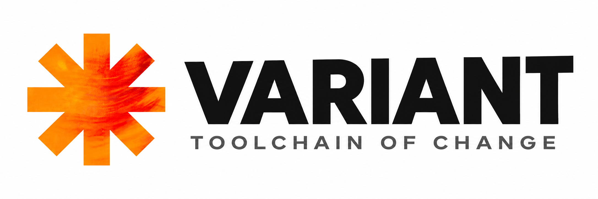

<p align="center">
  <picture>
    <source media="(prefers-color-scheme: dark)" srcset="./public/dark-mode.png">
    <source media="(prefers-color-scheme: light)" srcset="./public/light-mode.png">
    
  </picture>
</p>

<p align="center">
  <a href="https://www.npmjs.com/package/@blzsky/variant"></a>
  <a href="https://github.com/saintparish4/variant/actions/workflows/ci.yml?query=branch%3Amaster"></a>
  <a href="https://github.com/saintparish4/variant/actions/workflows/benchmark.yml?query=branch%3Amaster"></a>
  <a href="./package.json"></a>
  <a href="https://www.npmjs.com/package/@blzsky/variant"></a>
  <a href="./LICENSE"></a>
</p>

**Change intelligence for TypeScript monorepos.** variant reads a diff at the
AST level and answers one question: *which tests does this change actually
need, and how sure are we?*

<p align="center">
  
</p>

Both `shop` and `blog` depend on `utils`, so a tool that works from the package
graph would run all four test files. variant follows the imports: only `shop`
reaches the changed `price.ts`, and a doc comment on `slug.ts` selects nothing.

- **File-level, across packages.** Each test's import chain is followed through
  workspace packages, `exports` maps and tsconfig `paths`, not just the package
  graph.
- **Classified by exported surface.** Every changed file is `non-impacting`,
  `internal` or `breaking`. Comment-only edits select no tests; breaking changes
  follow the importers of the changed names.
- **One verdict per pull request,** ready to post as a comment.
- **A dependency gate:** `workspace check` fails CI when a package imports
  something it never declared.
- **Measured before trusted.** `impact` is report-only. Every prediction is
  logged, and `impact verify` checks it against your real test results. Test
  skipping stays off until the measured false-skip rate earns it, and the
  printed confidence is a graph-resolution score, not a safety number.

## Quick start

You need Node ≥ 20 and a git repository with at least one prior commit. There is
nothing to configure:

```bash
npx @blzsky/variant impact --base origin/main
```

To keep it in a project:

```bash
npm install -D @blzsky/variant    # or pnpm add -D / yarn add -D
```

The package is `@blzsky/variant`; the binary it installs is `variant`.
`npx variant` fetches an unrelated package, so always use the scope with `npx`.

```bash
variant impact --base origin/main          # which tests does this branch need?
npx vitest run --reporter=json --outputFile=report.json
variant impact verify report.json          # did the prediction miss a failure?
variant pr check --base origin/main        # one build verdict for the branch
variant workspace check                    # undeclared dependencies (exits 1)
```

The [tutorial](./docs/tutorial.md) walks through all of these on a sample
monorepo in about fifteen minutes.

## Commands

| Command | What it does |
|---|---|
| `impact` | Predict which test files a change requires, and how much of the import graph resolved. Report-only. |
| `impact verify <report>` | Reconcile the last prediction against a Vitest or Jest JSON report and report false skips |
| `diff <file>` | Classify one file's change and list the exported symbols that changed |
| `pr check` | Classify every TypeScript change on the branch and roll them into one build verdict |
| `pr report` | The `pr check` verdict as JSON, or as markdown for a PR comment |
| `workspace check` | Fail when a package imports a dependency it does not declare |

`build`, `run` and `insight` run a cached task graph from `variant.config.ts`.
`init`, `doctor`, `check` and `env` set it up and diagnose it. Every command and
flag is in the [CLI reference](./docs/cli-reference.md).

## In CI

Ready-to-copy GitHub Actions workflows are in
[`examples/github-actions`](./examples/github-actions):

- [`pr-report.yml`](./examples/github-actions/pr-report.yml) keeps one sticky
  comment with the verdict on every pull request.
- [`workspace-check.yml`](./examples/github-actions/workspace-check.yml) fails
  the build on an undeclared dependency.
- [`impact-shadow.yml`](./examples/github-actions/impact-shadow.yml) logs a
  prediction, runs the full suite, and reconciles the two.

Check out with `fetch-depth: 0` and pass `--base origin/<branch>`. With a
shallow clone, or a bare `main` that CI never created, there is no base to
diff against, and variant stops with `GIT_REF_ERROR` rather than guess.

## Documentation

| | |
|---|---|
| [Tutorial](./docs/tutorial.md) | Every command, step by step, on a sample monorepo |
| [Getting started](./docs/getting-started.md) | Run it on your own repository, then set up the task runner |
| [Impact & workspace](./docs/impact-and-workspace.md) | How `impact` and `workspace check` work, and what static analysis cannot see |
| [PR commands](./docs/pr-commands.md) | `pr check` and `pr report` |
| [CLI reference](./docs/cli-reference.md) | Every command, flag, exit code and file |
| [API reference](./docs/api.md) | `defineConfig`, the config types, and every JSON output |
| [Monorepo setup](./docs/monorepo.md) | Workspace tasks and `--affected` |
| [Config reference](./docs/config-reference.md) | Every `variant.config.ts` key |
| [Troubleshooting](./docs/troubleshooting.md) | Common problems and what they mean |

## Status

variant is `0.x`: any minor release can break, and every break is recorded in
the [CHANGELOG](./CHANGELOG.md). The change-intelligence commands are where
development happens. The task runner underneath (`build`, `run`, `insight`) is
feature-frozen.

## Contributing

Setup, architecture, testing and release notes are in
[CONTRIBUTORS.md](./CONTRIBUTORS.md). In short: every PR passes
`pnpm format:check`, `pnpm lint`, `pnpm typecheck` and `pnpm build`, and
changed behavior comes with a test.

## License

MIT. See [LICENSE](./LICENSE).
